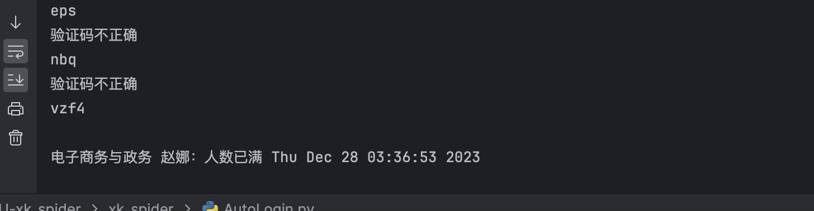

# YNU-xk_spider
云南大学选课爬虫，提供余课提醒服务，实现了自动抢课

* 来源于https://github.com/starwingChen/YNU-xk_spider
* 更进一步解决自动注销问题 2023-6-23测试三小时无注销
* 请自行搭建验证码识别api或自行寻找
* 解决api接口问题 2023-12-28多系统测试无异常
* 2023-12-30 经测试24小时无异常
## 项目环境：
* python版本：3.10
* 第三方库：selenium 4.1.0；requests ; flask 3.0.0; ddddocr 1.4.10                                
* Chrome版本：最新版本 及其对应driver

已经实现了余课提醒和自动抢课，余课提醒是通过server酱接口直接发送到你的微信上，为此你需要先从他们官网上获得一个key（[点击访问server酱官网，获取到key即可](http://sc.ftqq.com/3.version)），并且**关注"方糖"服务号**。具体操作官网都有写，我就不赘述了。

另外程序主要提供主修（包括必修和专选）和素选课程的提醒和抢课，**体育课和跨专业选修没测试过**，如果遇到问题可以在issue里提出来  


## 如何使用:
1. **安装好运行环境，下载此程序并解压。**
2. **切换到YNU-xk_spider-master目录**
3. **运行```pip install -r requirements.txt```**
4. **运行api.py文件**(!!!!本地识别一定要先运行这个)
5. **打开run.py文件。** 
6. **按照文件注释中的提示填写好字段，运行程序。**
    需要填的字段都已经用注释的形式标明了，填完直接运行即可。这之后程序会开始循环执行，同时打开一个窗口，登录进去等窗口自己关闭后就可以不用管了  

我已经尽量把代码封装成小白能使用的程度了，不需要有太多前端和python基础，安装完运行环境，照着注释将字段填好就完事了。程序已经做了初步的异常检测，如果您在运行时有什么问题，也可以在issue里提出来

另外，因为程序使用到了selenium模块，因此必须要下载Chrome浏览器驱动。具体教程[参考教程见此，另外不需要添加环境变量，记住你的下载路径就行](https://jingyan.baidu.com/article/f7ff0bfcdd89ed2e27bb1379.html)，如果您的电脑未安装Chrome浏览器，这边建议您安装一个，而且没有Chrome此程序无法运行。chreomeDriver下载地址:https://googlechromelabs.github.io/chrome-for-testing/

## 自行搭建api方法

打开api.py

```python
pip install ddddocr
pip install flask
```

然后直接运行api.py

(也可在腾讯云函数搭建)

**如果本项目有帮到你，可以点击右上角的star支持一下 :)**

### 云函数搭建方法

```shell
docker pull ccr.ccs.tencentyun.com/ocrr/ocr:2.0.0
```

打完tag后上传到你自己的仓库然后使用云函数docker部署


高级配置拉满


然后测试即可


### 注意

使用云函数需要修改AutoLogin.py中的imgcode_online函数

```python
def imgcode_online(imgurl):
    if not hasattr(imgcode_online, "counter"):
        imgcode_online.counter = 0
    if not hasattr(imgcode_online, "timestamp"):
        imgcode_online.timestamp = time.time()

    current_time = time.time()
    if current_time - imgcode_online.timestamp > 60:
        imgcode_online.counter = 0
        imgcode_online.timestamp = current_time

    imgcode_online.counter += 1
    if imgcode_online.counter > 10:
        imgcode_online.counter = 0
        imgcode_online.timestamp = current_time
        return False

    # Convert base64 image to bytes
    img_data = base64.b64decode(imgurl.split(",")[-1])
    files = {'image': ('image.jpg', img_data)}
    response = requests.post('云函数给你的访问路径url/ocr/file/json', files=files)

    if response.text:
        try:
            result = json.loads(response.text)
            if result['status'] == 200:
                print(result['result'])
                return result['result']
            elif result['status'] != 200:
                time.sleep(10)
                return imgcode_online(imgurl)
            else:
                print(result['msg'])
                return 'error'
        except json.JSONDecodeError:
            print("Invalid JSON received")
            return 'error'
    else:
        print("Empty response received")
        return 'error'
```

## 成功示例：
**ps：抢课成功的实例也类似，基本上只要有人退课你就能抢到**


2023-6-23注销测试


2023-12-28修复成功



## 郑重声明:

### 此程序仅作为技术交流之用，请不要将其用于任何形式的收费行为中  
