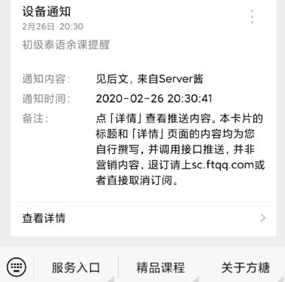
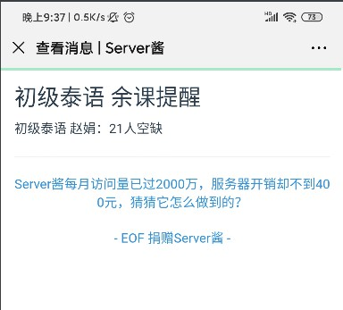

# YNU-xk_spider
云南大学选课爬虫，提供余课提醒服务，实现了自动抢课

* 来源于https://github.com/starwingChen/YNU-xk_spider
* -~~目前脚本连续运行一天左右会自动注销，等我有能力了大概会进行修复（大概~~
* ~~由于这次选课时间时处考试周 此次选择的对抗注销的机制为重新登录 固需要一个稳定的验证码识别api~~
* 示例采用的免费api不太靠谱 可自行于autologin.py中的imgcode_online函数中自行根据文档修改接口
* 更进一步解决自动注销问题 2023-6-23测试三小时无注销
* 若使用免费的验证码api 请按照run.py的注释自行申请token
## 项目环境：
* python版本：3.10
* 第三方库：selenium 4.1.0；requests 2.26.0                                 
* Chrome版本：114.0.3987.116 及其对应driver

已经实现了余课提醒和自动抢课，余课提醒是通过server酱接口直接发送到你的微信上，为此你需要先从他们官网上获得一个key（[点击访问server酱官网，获取到key即可](http://sc.ftqq.com/3.version)），并且**关注"方糖"服务号**。具体操作官网都有写，我就不赘述了。

另外程序主要提供主修（包括必修和专选）和素选课程的提醒和抢课，**体育课和跨专业选修没测试过**，如果遇到问题可以在issue里提出来  
  
  
## 如何使用:
1. **安装好运行环境，下载此程序并解压。**
2. **将run.py文件向外移动一层**
3. **打开run.py文件。** 
4. **按照文件注释中的提示填写好字段，运行程序。**
需要填的字段都已经用注释的形式标明了，填完直接运行即可。这之后程序会开始循环执行，同时打开一个窗口，登录进去等窗口自己关闭后就可以不用管了  

我已经尽量把代码封装成小白能使用的程度了，不需要有太多前端和python基础，安装完运行环境，照着注释将字段填好就完事了。程序已经做了初步的异常检测，如果您在运行时有什么问题，也可以在issue里提出来

另外，因为程序使用到了selenium模块，因此必须要下载Chrome浏览器驱动。具体教程[参考教程见此，另外不需要添加环境变量，记住你的下载路径就行](https://jingyan.baidu.com/article/f7ff0bfcdd89ed2e27bb1379.html)，如果您的电脑未安装Chrome浏览器，这边建议您安装一个，而且没有Chrome此程序无法运行

**登录过程中如果出现"认证失败"，那是服务器抽风导致的（雨我无瓜），此时刷新页面或退掉重开都行**  

**如果本项目有帮到你，可以点击右上角的star支持一下 :)**

## 成功示例：
**ps：抢课成功的实例也类似，基本上只要有人退课你就能抢到**

2023-6-23注销测试

## 郑重声明:
### 此程序仅作为技术交流之用，请不要将其用于任何形式的收费行为中  
